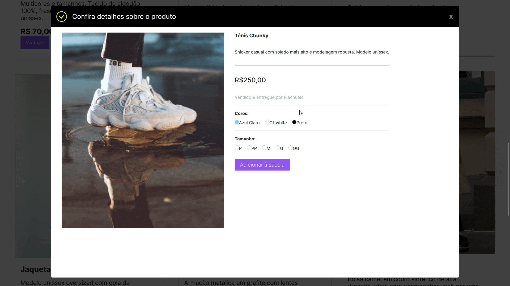
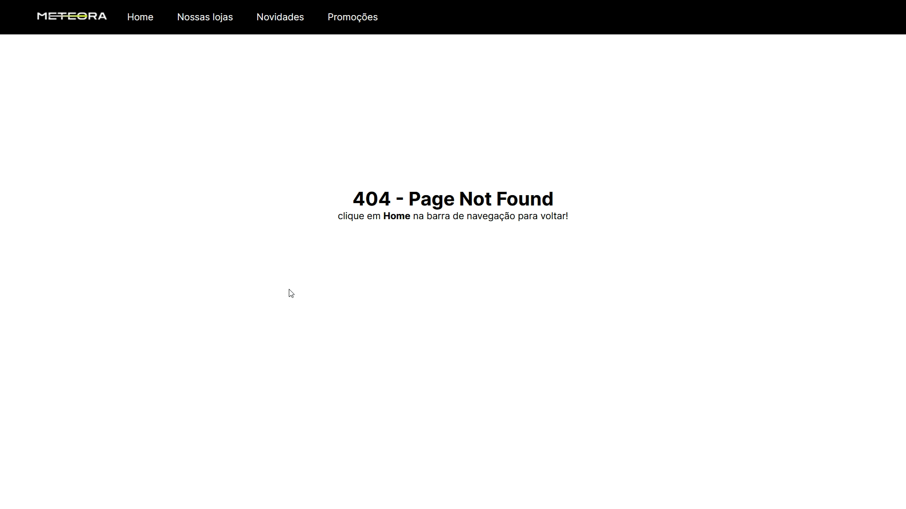
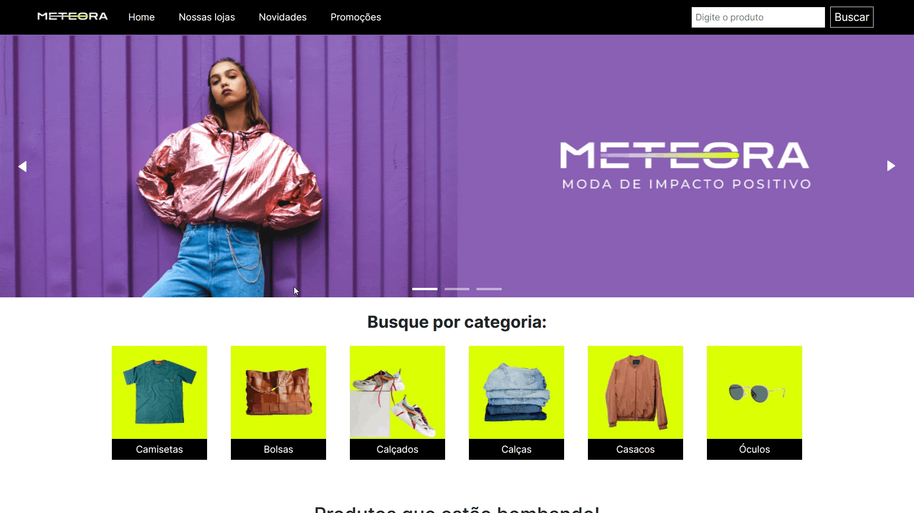

# Meteora - 7º Challenge Front-end Alura

Projeto criado para o [challenge front-end 7ª edição](https://www.alura.com.br/challenges/front-end-7).

| :placard: Vitrine.Dev |     |
| -------------  | --- |
| :sparkles: Nome        | **Meteora -** Challenge Front End
| :label: Tecnologias | React, JavaScript, Next.js, Styled Components, MongoDB, SwiperJS
| :rocket: URL         | https://meteora-kohl.vercel.app/
| :fire: Desafio     | [**Design no Figma**](https://www.figma.com/file/2TLgt8UjsWUViWlmpXu5Fz/Loja-Meteora?type=design&node-id=2386%3A3188&t=KAouN13HHl42mSWm-1)

<!-- Inserir imagem com a #vitrinedev ao final do link -->

<!--  -->

- A lista de produtos que é exibida no site está armazenada no MongoDB Atlas. 

## Detalhes do projeto

O objetivo do desafio é criar o front-end da loja virtual fictícia de roupas **Meteora**.

### Demonstração do filtro de categoria

 

### Demonstração do filtro da barra de pesquisa
- filtrando por nome do produto 

 

### Demonstração do zoom no modal do produto

 

- Eu usei o react-image-magnify para criar este efeito de zoom.

### Outras Páginas

#### Página Erro 404

#### Página Em breve

- No lugar das páginas **Nossas Lojas**, **Novidades** e **Promoções**, eu redirecionei para a página **Em breve**, pois essas páginas não faziam parte do desafio, o layout base que está no Figma só possui a página Home.

- Observe que somente na página **Home** que a barra de pesquisa é renderizada. Nas páginas **Erro 404** e **Em breve**, a barra de pesquisa não é renderizada, pois não há produtos para pesquisar.