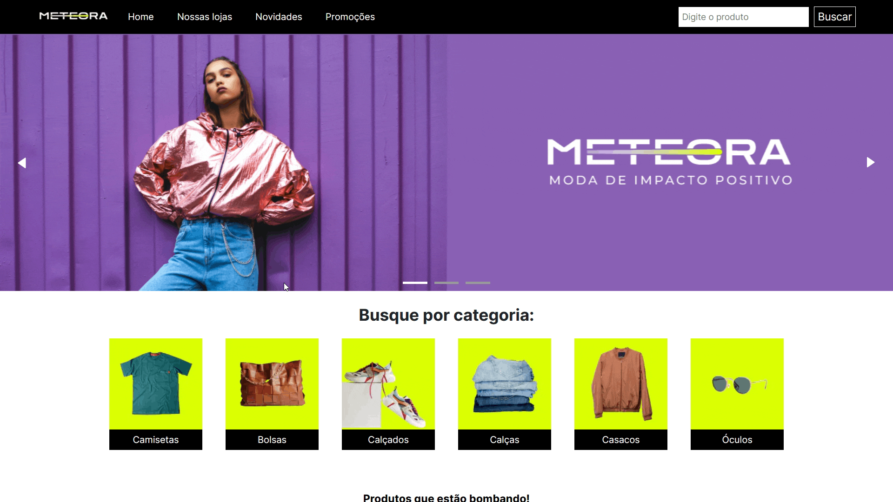

# Meteora - 7º Challenge Front-end Alura

Projeto criado para o [challenge front-end 7ª edição](https://www.alura.com.br/challenges/front-end-7).

| :placard: Vitrine.Dev |     |
| -------------  | --- |
| :sparkles: Nome        | **Meteora -** Challenge Front End
| :label: Tecnologias | React, JavaScript, Next.js, Styled Components, MongoDB
| :rocket: URL         | https://meteora-kohl.vercel.app/
| :fire: Desafio     | [**Design no Figma**](https://www.figma.com/file/2TLgt8UjsWUViWlmpXu5Fz/Loja-Meteora?type=design&node-id=2386%3A3188&t=KAouN13HHl42mSWm-1)

<!-- Inserir imagem com a #vitrinedev ao final do link -->

<!--  -->

## Detalhes do projeto

O objetivo do desafio é criar o front-end da loja virtual fictícia de roupas **Meteora**.

### Demonstração do filtro de categoria

 

